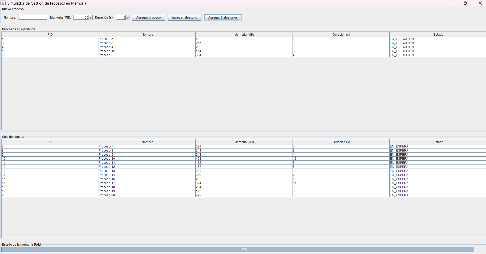
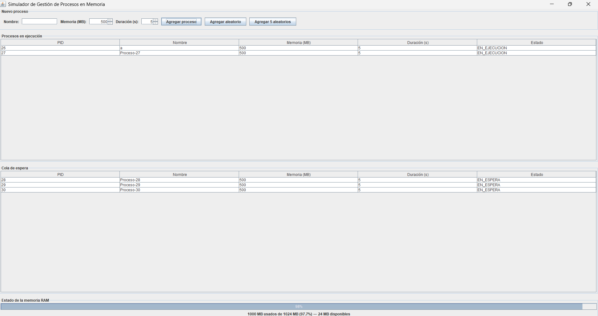

# Simulador de Gestión de Procesos en Memoria

Simulador de un sistema operativo simplificado que administra la ejecución de procesos sobre una memoria RAM limitada (1 GB). El sistema gestiona una cola de espera para los procesos que no caben en memoria, ejecuta procesos de forma concurrente mediante hilos, y libera automáticamente la memoria cuando un proceso finaliza.

## Descripción del proyecto

El programa simula el comportamiento de un sistema operativo frente a la gestión de memoria:

- Cada **proceso** tiene un PID único, nombre, memoria requerida (MB) y duración de ejecución (segundos).
- Existe **1 CPU** y **1024 MB (1 GB)** de memoria RAM disponibles para todos los procesos.
- Si un proceso no cabe en la memoria disponible al momento de crearse, se coloca en una **cola de espera (FIFO)**.
- Los procesos que sí caben se ejecutan de forma **concurrente** (cada uno en su propio hilo), simulando el uso real del CPU durante su tiempo de duración.
- Al finalizar un proceso, su memoria se **libera automáticamente** y el sistema revisa la cola de espera para iniciar los procesos que ya puedan ejecutarse.
- Una interfaz gráfica muestra en tiempo real los procesos en ejecución, los procesos en espera, y el estado de la memoria (barra de uso).

## Tecnologías implementadas

- **Lenguaje:** Java (JDK 8+)
- **Interfaz gráfica:** Swing (librería estándar de Java, sin dependencias externas)
- **Concurrencia:** `java.lang.Thread` para la ejecución concurrente de procesos, con sincronización (`synchronized`) para el acceso seguro a la memoria compartida
- **IDE de desarrollo:** NetBeans

## Estructura del proyecto

```
src/
├── Main.java                    # Punto de entrada de la aplicación
├── modelo/
│   ├── Proceso.java             # Representa un proceso (PID, nombre, memoria, duración, estado)
│   └── GestorMemoria.java       # Administra la memoria RAM disponible (asignación/liberación)
├── logica/
│   ├── Planificador.java        # Cola de espera, lista de ejecución, coordinación general
│   └── HiloProceso.java         # Hilo que simula la ejecución de un proceso
└── vista/
    └── VentanaPrincipal.java    # Interfaz gráfica (Swing)
```

## Instrucciones de instalación y uso

### Requisitos

- Java JDK 8 o superior instalado
- NetBeans IDE (recomendado) o cualquier IDE compatible con Java

### Pasos

1. Clonar el repositorio:
   ```
   git clone https://github.com/pjiatzc1-hub/simulador-gestion-procesos.git
   ```
2. Abrir el proyecto en NetBeans: **File → Open Project** y seleccionar la carpeta clonada.
3. Ejecutar el proyecto: clic derecho sobre el proyecto → **Run** (o presionar **F6**).
4. Se abrirá la ventana del simulador.

### Cómo usar el simulador

- **Agregar proceso (manual):** completa el nombre (opcional), la memoria requerida en MB y la duración en segundos, luego presiona **"Agregar proceso"**.
- **Agregar proceso aleatorio:** presiona **"Agregar aleatorio"** para generar un proceso con memoria y duración al azar.
- **Agregar varios de golpe:** presiona **"Agregar 5 aleatorios"** para saturar rápidamente la memoria y ver la cola de espera en acción.
- La tabla superior muestra los **procesos en ejecución**; la tabla inferior, los **procesos en cola de espera**.
- La barra inferior muestra la **memoria usada y disponible** en tiempo real.

## Capturas de pantalla

> Reemplaza estas líneas con tus propias capturas subidas al repositorio (por ejemplo, dentro de una carpeta `capturas/`).

**Procesos en ejecución y en cola de espera:**



**Estado de la memoria RAM:**




## Autoría

Proyecto desarrollado para el curso de Sistemas Operativos.
